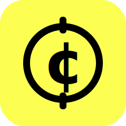
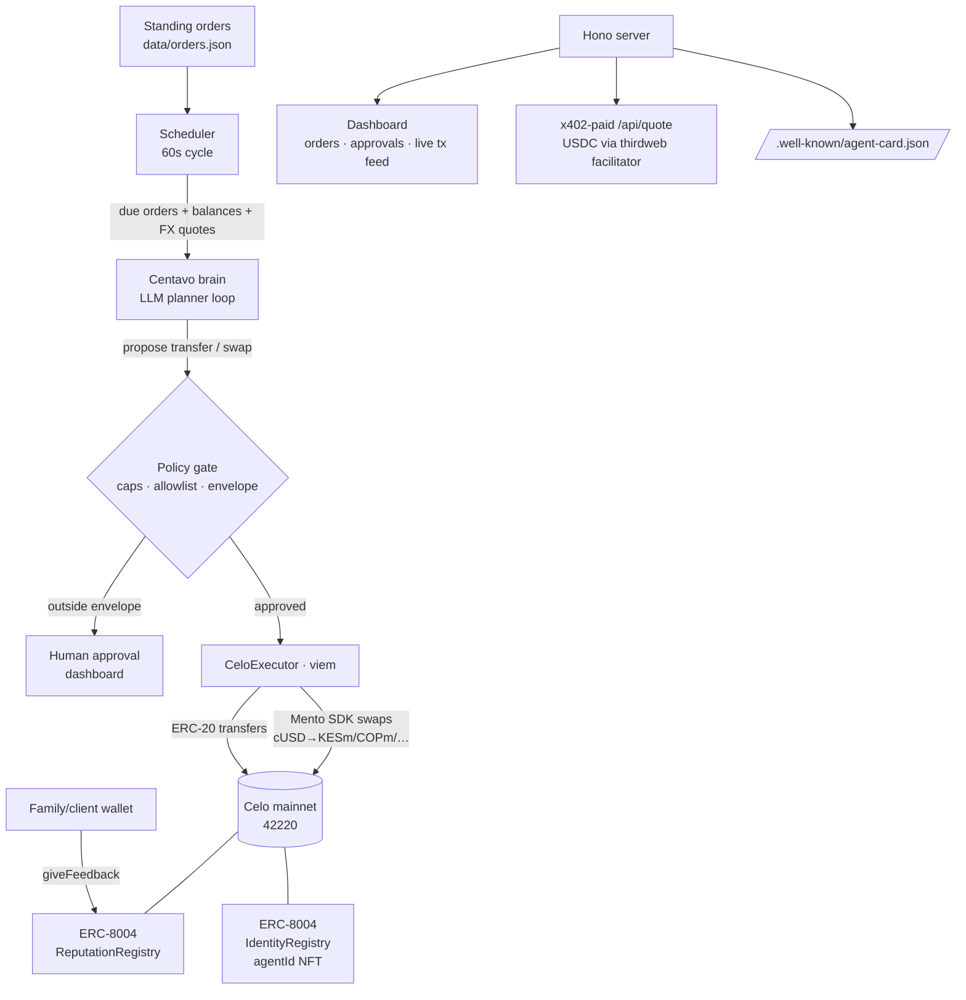

<p align="center"></p>

# Centavo — a budget-capped payments steward on Celo

**Centavo runs your everyday micro-payments as real Celo transactions.** Give it standing orders in
plain language — *"send the family wallet 0.05 cUSD every 4 hours"*, *"DCA 0.10 cUSD into Kenyan
shillings daily"* — and on every cycle its LLM brain reviews what's due, checks live balances and
Mento FX quotes, and executes on-chain. Every action passes a **hard policy gate** (per-tx cap,
daily cap, recipient allowlist): approve an order's envelope once, and every repeat runs
autonomously inside it; anything outside pauses for human approval.

Built for the **Celo Onchain Agents Hackathon** (June 2026).

## What makes it an *onchain agent*, not a demo

| Capability | How |
|---|---|
| **On-chain identity** | Registered on **ERC-8004** (`IdentityRegistry 0x8004A169…a432` on Celo) with a spec-compliant, content-addressed agent card → ranked on [8004scan](https://8004scan.io) |
| **Real payments** | cUSD/USDC transfers + **Mento** FX swaps (cUSD → KESm/COPm/EURm/BRLm…) on Celo mainnet, receipts awaited, reasons logged |
| **Agent economy (x402)** | Pays for data via **x402 (thirdweb facilitator on Celo)** and *sells* its own x402-paid API: `GET /api/quote` — live Mento corridor quotes for a fraction of a cent in USDC |
| **On-chain reputation** | After each delivered order, the counterparty wallet records `giveFeedback` on the ERC-8004 ReputationRegistry |
| **Safety** | Dedicated low-balance wallet · policy caps mirrored off-chain before any signature · human-in-the-loop for anything unusual · append-only audit log (JSONL) |

## Architecture



## Quickstart

```bash
npm install
cp .env.example .env        # fill in (see below)
npm run wallet              # generates a fresh AGENT_PRIVATE_KEY into .env
npm run dev                 # dashboard + scheduler + agent card + x402 endpoint on :8787
```

Fund the printed agent address with a small amount of **CELO on Celo mainnet** (gas is sub-cent;
the agent self-provisions cUSD via Mento with its "Operating float top-up" order). Then in the
dashboard, review each standing order and click **Approve & start**.

```bash
npm run register            # registers the agent on ERC-8004 → agentId + 8004scan link
npm run daemon              # headless 24/7 activity loop (alternative to the server)
npm run cycle               # run one scheduler cycle and exit
npm test && npm run typecheck
```

### Environment (`.env`, never committed)

| Var | Purpose |
|---|---|
| `CHAIN` | `celo` (mainnet) or `celoSepolia` |
| `AGENT_PRIVATE_KEY` | dedicated agent wallet — generate with `npm run wallet`, fund with a few CELO only |
| `VENICE_API_KEY` / `VENICE_BASE_URL` / `VENICE_MODEL` | LLM reasoner (any OpenAI-compatible endpoint) |
| `FAMILY_WALLET` / `FAMILY_WALLET_KEY` | demo counterparty: allowance recipient + reputation-feedback sender |
| `THIRDWEB_SECRET_KEY` / `THIRDWEB_SERVER_WALLET` | x402 facilitator (free at thirdweb.com); optional — without it `/api/quote` serves free |
| `PUBLIC_BASE_URL` | public https origin for the agent card once deployed |

## The policy gate (the core idea)

The brain can *only* act through `checkPolicy`: spend tokens must be whitelisted, swap outputs must
be on the receivable list, recipients must be allowlisted, and per-tx + global daily caps are
enforced in normalized units across mixed-decimal tokens (cUSD 18, USDC 6). Standing orders a human
has approved run inside that envelope without further clicks — that's real economic agency with
cryptographically small blast radius. Raw `call`s always require a human.

## Provenance

The planner/policy core is ported from our own prior agent ("Steward", built for the MetaMask Dev
Cook-Off and proven on Base mainnet); everything Celo-specific — ERC-8004 identity + reputation,
Mento FX, x402 on Celo, the standing-orders activity engine, dashboard — was built during this
hackathon window. Registry addresses and ABIs come from Celo's official docs/Celopedia and were
re-verified against Blockscout's verified contracts (archived in `docs/erc8004-*.abi.json`).

## License

MIT — see [LICENSE](LICENSE).
